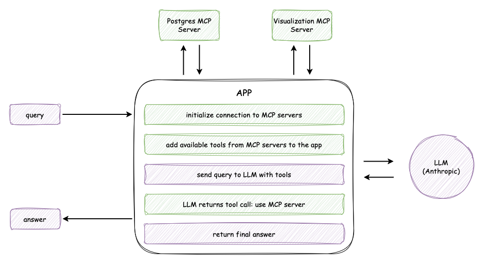

# AI Based Reporting App

This mini project demonstrates how to build an AI-based reporting application that enables users to generate flexible, criteria-driven reports. Users can simply type their reporting criteria, and the app—powered by an LLM (Anthropic) and Model Context Protocol (MCP) servers—automatically generates analytical results and visualizations. The system integrates two MCP servers: a Postgres MCP server for querying data sources, and a custom MCP server for creating visualizations. This architecture allows for dynamic, user-driven reporting and insightful data analysis with minimal manual setup.

## Architecture



## Prerequisites

Before running the application, ensure you have the following:

- **Python 3.12 or later**: Required to run the application.
- **Postgres Database**: Set up as the data source for reporting.
- **Postgres MCP Server**: For querying data dynamically.
- **Anthropic API Key**: Access to Anthropic's LLM for natural language processing.
- **Node.js 23.10 or later**: Needed to run the Postgres MCP Server.

Additionally, import the example SQL schema provided in the repository to set up the Postgres database. This will act as the data source for testing the reporting app. You can find the schema [here](scripts.sql)

## How to Run

Follow these simple steps to set up and run the AI-based reporting application:

### 1. Clone the Repository

First, clone the project repository to your local machine and navigate into the project directory:

```bash
$ git clone https://github.com/Dandi-Pangestu/ai-based-reporting-app.git
$ cd ai-based-reporting-app
```

### 2. Install Dependencies

Ensure you have Python installed, then use `pip` to install the required dependencies for the project:

```bash
$ pip install .
```

This will install all the necessary libraries and dependencies listed in the project.

### 3. Set Up Environment Variables

The application relies on specific environment variables to connect to external services like the database, Anthropic API, and visualization server. To configure these:

1. Navigate to the `api` folder and locate the `.env.example` file.
2. Copy the `.env.example` file to a new `.env` file:

   ```bash
   $ cp api/.env.example api/.env
   ```

3. Open the `.env` file and fill out the following variables based on your environment:

   ```plaintext
   ANTHROPIC_API_KEY=your_anthropic_api_key
   DATABASE_HOST=your_database_host
   DATABASE_USERNAME=your_database_username
   DATABASE_PASSWORD=your_database_password
   DATABASE_NAME=your_database_name
   DATABASE_PORT=your_database_port
   VISUALIZATION_SERVER_PATH=your_visualization_server_path
   ```

   Replace placeholders like `your_anthropic_api_key` with actual values specific to your setup.

### 4. Run the Application

Start the application using the following command:

```bash
$ uvicorn main:app --reload
```

This command runs the application using Uvicorn, a fast ASGI server, with auto-reload enabled for development.

### 5. Access the Application

Once the server is running, you can access the API on your local machine by navigating to:

```
http://localhost:8000
```

The application will now be live and ready to process user queries for generating reports.

## API Endpoints

Below are the key API endpoints available in the AI-based reporting app:

### 1. **Get Available Servers**
Retrieve the list of MCP servers connected to the application.

```bash
curl --location 'http://localhost:8000/servers'
```

---

### 2. **Get Available Tools**
Retrieve the list of tools dynamically added to the application from MCP servers.

```bash
curl --location 'http://localhost:8000/tools'
```

---

### 3. **Query the AI Reporting App**
Send a query to the AI-powered reporting app to generate results and visualizations based on the specified criteria.

```bash
curl --location 'http://localhost:8000/query' \
--header 'Content-Type: application/json' \
--data '{
    "query": "List the top 3 organization id with the highest average messages count from metrics_rooms. Please generate chart visualization with type bar and also please give me analysis for that result."
}'
```

This endpoint processes the query by leveraging the integrated LLM and MCP servers to generate both analytical results and the requested visualization.